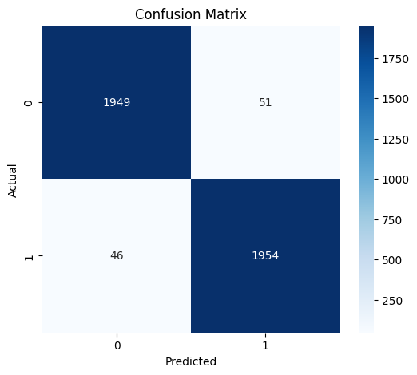

# Deepfake Audio Detection

## Live Demo

Streamlit App:
https://deepfake-audio-detection-b4e4aa3pohjtqh4xoz5hmu.streamlit.app/

## Project Overview

Deepfake audio refers to artificially generated speech created using AI models that imitate human voices. Such audio can be used for impersonation, misinformation, and fraud.

This project detects whether an audio recording is Genuine (human speech) or Deepfake (AI-generated speech) using MFCC feature extraction and a Random Forest classifier.

---

## Features

* Upload audio files through a web interface
* Detect Genuine vs Deepfake speech
* Display prediction confidence score
* Fast inference using a trained Random Forest model
* Interactive Streamlit web application

---

## Tech Stack

* Python
* Librosa
* NumPy
* Scikit-Learn
* Streamlit
* Joblib
* Matplotlib
* Seaborn

---

## Methodology

1. Load audio files at 16 kHz.
2. Extract 40 MFCC features.
3. Compute mean MFCC feature vector.
4. Train Random Forest classifier.
5. Predict whether uploaded audio is Genuine or Deepfake.

Pipeline:

Audio → MFCC Extraction → Random Forest → Prediction

---

## Results

| Metric   | Value  |
| -------- | ------ |
| Accuracy | 97.57% |
| F1 Score | 97.8%  |
| EER      | 2.50%  |

## Confusion Matrix



---

## Running the Application

Install dependencies:

```bash
pip install -r requirements.txt
```

Run the Streamlit app:

```bash
streamlit run app.py
```

---

## Prediction Script

```bash
python predict.py audio.wav
```

---

## Project Structure

Deepfake-Audio-Detection/

├── notebook.ipynb

├── app.py

├── predict.py

├── deepfake_model.pkl

├── requirements.txt

├── README.md

└── confusion_matrix.png

